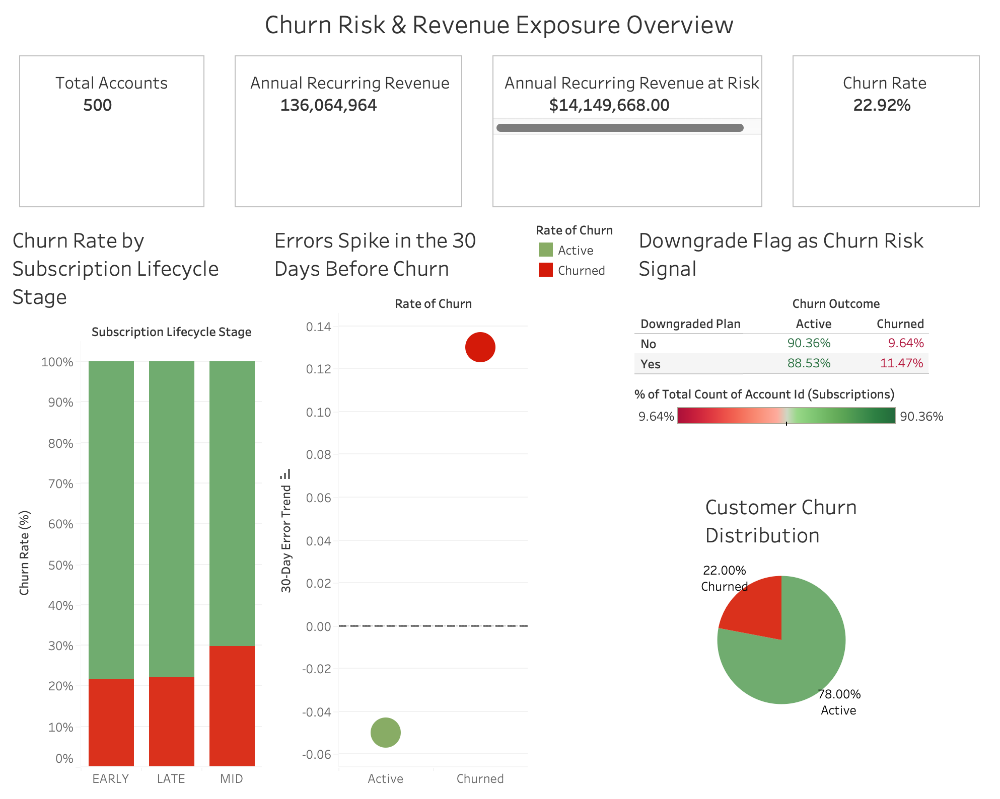

# Customer Churn & Revenue Risk Analysis

SQL + Tableau analysis of customer churn patterns and revenue exposure, identifying lifecycle risk segments, downgrade behavior, and pre-churn error spikes driving **$14.1M in ARR at risk**.

## Overview
This project analyzes customer churn behavior and quantifies revenue exposure using subscription and feature usage data. The final output is a Tableau dashboard with KPIs and risk drivers.

## Business Questions
- What percentage of customers churn?
- How much Annual Recurring Revenue (ARR) is at risk?
- Where does churn concentrate across the subscription lifecycle?
- Do plan downgrades signal churn risk?
- Do error spikes precede churn?

## Key Findings
- **22.9% churn rate**
- **$14.1M ARR at risk**
- **Mid-lifecycle customers show the highest churn**
- **Downgrades precede churn**
- **30-day error increases are higher among churned accounts**

## Dashboard
**Churn Risk & Revenue Exposure Overview**
- KPIs: Total Accounts, ARR, ARR at Risk, Churn Rate
- Churn by Subscription Lifecycle Stage
- 30-Day Error Trend Before Churn
- Downgrade Flag as a Churn Risk Signal (heatmap)
- Customer Churn Distribution

## Dashboard Preview

## Data & Definitions
- **Churned** = subscriptions with `churn_outcome = TRUE`
- **ARR at Risk** = sum of ARR for churned subscriptions
- **30-day error trend** = change in error count over the last 30 days (see SQL)

## How to Reproduce
1. Load the provided tables into PostgreSQL (or connect Tableau to your DB)
2. Run the SQL queries in `/sql/` to generate the analysis fields
3. Open the Tableau workbook in `/tableau/` (or connect to the DB and refresh extracts)

## Repo Structure
- `/sql/` — SQL queries used to create KPIs and analysis features
- `/tableau/` — Tableau workbook/dashboard
- `/dashboardoverview/` — dashboard screenshots for the README

## Tools Used
- PostgreSQL
- Tableau
